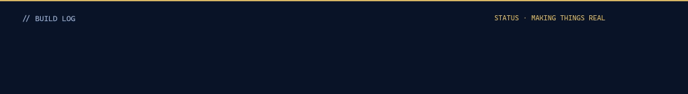
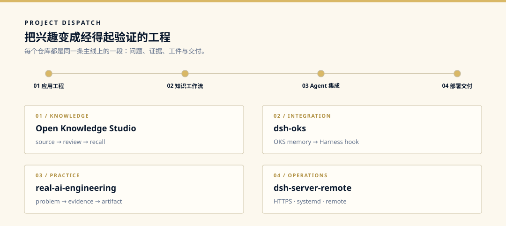

  

  <code>Java 全栈</code>
  &nbsp;·&nbsp;
  <code>知识工作流</code>
  &nbsp;·&nbsp;
  <code>Agent / Harness</code>
  &nbsp;·&nbsp;
  <code>可部署交付</code>

  

  

## 我在做什么

我从 **Java 全栈**出发，习惯把模糊的想法拆成可验证、可运行的工具。现在正把知识工作流、Agent 集成与部署交付串成一条实战路径：兴趣负责点火，仓库负责交付。

### 路径

`完整应用工程` → `可回溯的知识` → `可控的 Agent` → `可运行的交付`

- **应用工程**：Java、Spring Boot、Vue、TypeScript
- **知识工作流**：来源、审阅、召回与可追溯的知识资产
- **Agent 集成**：Harness、Skills、Adapters 与确定性工作流
- **部署交付**：Docker、Linux、HTTPS、systemd 与远程运行

## 项目选集

  

  <a href="https://github.com/1263-ux/open-knowledge-studio">Open Knowledge Studio</a>
  &nbsp;·&nbsp;
  <a href="https://github.com/1263-ux/dsh-oks">dsh-oks</a>
  &nbsp;·&nbsp;
  <a href="https://github.com/1263-ux/real-ai-engineering">real-ai-engineering</a>
  &nbsp;·&nbsp;
  <a href="https://github.com/1263-ux/dsh-server-remote">dsh-server-remote</a>

> 没有真实问题，不产生资产；没有真实验证，不包装成熟。

Build with curiosity. Ship with evidence.

