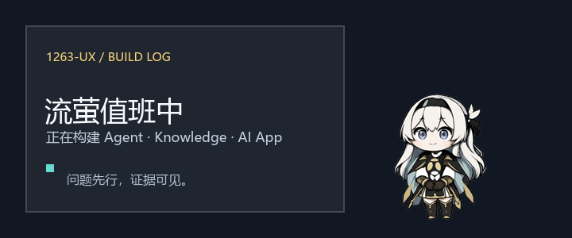

  

   

  <code>Java 全栈</code>
  &nbsp;·&nbsp;
  <code>AI 应用开发</code>
  &nbsp;·&nbsp;
  <code>Agent / Harness</code>
  &nbsp;·&nbsp;
  <code>知识工程</code>

## 👋 你好，我是 1263-ux

我从 Java 全栈应用开发出发，正在把重心放到 AI Native Coding、Agent Engineering 和 Knowledge Engineering。

我想做的不是一个“会聊天”的 Demo，而是能长期运行、能够追溯、真正可以交付的 AI 系统。

## / now

- 🤖 **Agent Engineering**：长任务工作流、Harness、Skills、Adapters
- 🧠 **Knowledge Engineering**：RAG、Evidence、Review、Recall
- 🛠 **AI Application**：Java、Spring Boot、Vue、TypeScript、Docker、Linux
- 🔐 **Exploring**：从执行、远程访问与可信结果出发，研究 AI × Security

## ✨ 项目选集

- 🧩 **[real-ai-engineering](https://github.com/1263-ux/real-ai-engineering)** —— 从真实 AI 开发问题中沉淀可复用的 Skills、Adapters、Scripts 和 Cases。`Problem → Evidence → Artifact`

- 📚 **[Open Knowledge Studio](https://github.com/open-agent-power/open-knowledge-studio)** —— Agent-native、filesystem-first 的知识工作区：将来源变成可审核、可追溯、可召回的知识。`Source → Candidate → Review → Recall`

- 🛰 **[dsh-server-remote](https://github.com/1263-ux/dsh-server-remote)** —— DeepSeek Harness 的 Linux 远程部署方案，覆盖 HTTPS、认证、systemd 与运维文档。

- 🏗 **[oh-my-admin](https://github.com/open-agent-power/oh-my-admin)** —— 基于 ContiNew 的精简型中后台系统，也是我继续构建 AI 系统之前扎实走过的 Java / Spring Boot / Vue 工程底子。

## 🪄 流萤桌宠

主页顶部的动态图片不是装饰素材：它由 **[流萤桌宠](https://github.com/1263-ux/--skills)** 中真实的 idle 与 happy 帧合成。这个 Electron + Vue 3 桌宠支持透明置顶、拖拽、点击互动、情绪状态与台词 fallback，也为后续接入 AI 对话留了接口。

## 🧭 我相信

> **Problem first, artifact second.**
>
> 没有真实问题，不急着造抽象；没有真实验证，不把实验包装成成熟方案。

  Build with curiosity. Ship with evidence.

