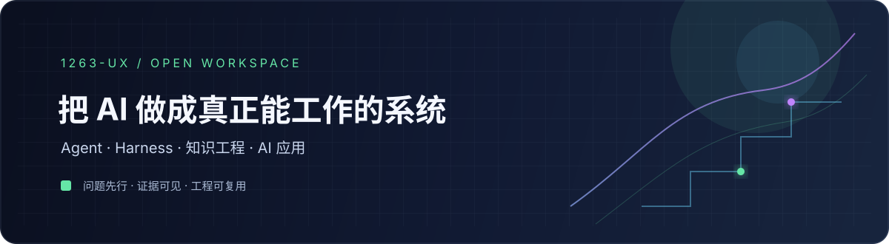

  

   

  

    <strong>Java 全栈背景 · AI 应用开发 · Agent / Harness · 知识工程</strong>
  

  

    <a href="https://github.com/1263-ux/real-ai-engineering">真实问题</a>
    &nbsp;·&nbsp;
    <a href="https://github.com/open-agent-power/open-knowledge-studio">知识工作流</a>
    &nbsp;·&nbsp;
    <a href="https://github.com/1263-ux/dsh-server-remote">远程部署</a>
    &nbsp;·&nbsp;
    <a href="https://github.com/open-agent-power/oh-my-admin">应用工程</a>
  

## 👋 关于我

我在做的，不只是“把大模型接进项目”。

我更关心 Agent 真正开始工作之后的问题：**工作流能不能持续、知识能不能追溯、部署能不能维护、结果能不能验证。**

目前正从 Java 全栈应用开发，深入到 AI Native Coding、Agent Engineering 和 Knowledge Engineering；同时从工程实践出发，探索 AI × 网络安全。

<table>
  <tr>
    <td width="50%" valign="top">
      <h3>🤖 Agent Engineering</h3>
      Skills · Harness · 长任务 · Workflow 
      把一次性的提示词，变成可以复用的工作方式。
    </td>
    <td width="50%" valign="top">
      <h3>🧠 Knowledge Engineering</h3>
      RAG · Evidence · Review · Recall 
      让知识有来源、有审核，也能被 Agent 找回来。
    </td>
  </tr>
  <tr>
    <td width="50%" valign="top">
      <h3>🛠 AI Application</h3>
      Java · Spring Boot · Vue · TypeScript 
      保留完整的应用工程与交付能力。
    </td>
    <td width="50%" valign="top">
      <h3>🔐 Exploring</h3>
      AI × Security · Remote Access · Trust 
      关注 Agent 系统在真实环境里的边界与风险。
    </td>
  </tr>
</table>

## 🚀 正在做的项目

<table>
  <tr>
    <td width="50%" valign="top">
      <h3><a href="https://github.com/1263-ux/real-ai-engineering">real-ai-engineering</a></h3>
      从真实 AI 开发问题里沉淀可复用资产：Skills、Adapters、Scripts、Cases。
        
      <code>Problem → Evidence → Artifact</code>
    </td>
    <td width="50%" valign="top">
      <h3><a href="https://github.com/open-agent-power/open-knowledge-studio">Open Knowledge Studio</a></h3>
      Agent-native、filesystem-first 的知识工作区：把来源变成可审核、可追溯、可召回的知识。
        
      <code>Source → Candidate → Review → Recall</code>
    </td>
  </tr>
  <tr>
    <td width="50%" valign="top">
      <h3><a href="https://github.com/1263-ux/dsh-server-remote">dsh-server-remote</a></h3>
      面向 Linux 的 DeepSeek Harness 远程部署方案，包含 HTTPS、认证、systemd 与运维文档。
        
      <code>HTTPS · Auth · Linux · Deployment</code>
    </td>
    <td width="50%" valign="top">
      <h3><a href="https://github.com/open-agent-power/oh-my-admin">oh-my-admin</a></h3>
      基于 ContiNew 的精简型中后台系统，Spring Boot 后端 + Vue 3 / TypeScript 前端。
        
      <code>Java · Spring Boot · Vue · TypeScript</code>
    </td>
  </tr>
</table>

## 🧪 其他实验

### [流萤桌宠](https://github.com/1263-ux/--skills)

一个离线优先的桌面宠物实验：Electron、Vue 3、TypeScript、EventBus 与状态机，也在尝试为未来的 AI 对话接口留下空间。

## 🧭 我相信

> **Problem first, artifact second.**
>
> 没有真实问题，不急着造抽象；没有真实验证，不把实验包装成成熟方案。

我会继续把这些项目做成一条能看见演进过程的工程轨迹。

   
  Build with curiosity. Ship with evidence.

